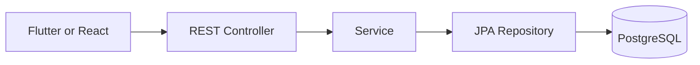

# Backend Architecture

## Runtime Map



## Boundaries

- `controller`: HTTP request parsing, DTO validation, authentication context, response mapping.
- `service`: business rules, authorization/ownership checks, use-case orchestration, and transaction boundaries.
- `repository`: Spring Data JPA queries and persistence operations.
- `entity`: JPA mappings and entity state; JPA annotations are allowed.
- `dto`: request and response contracts, independent of persistence entities.
- `config`: Spring configuration such as OpenAPI and security.
- `exception`: application exceptions and HTTP error mapping with controller advice.

These are packages under `com.ahni.backend`, not separate Gradle modules. Create a package with its first real class; do not add placeholder classes or an interface/implementation pair for every service.

## Allowed Dependency Direction

```text
Controller → Service → Repository → Entity
Controller → DTO ← Service
Service → Entity
```

- Controllers never access repositories, JPA, or JDBC directly and never expose entities in API signatures. Services map entities to response DTOs.
- Services may depend directly on repositories, but never on controllers. Repositories never depend on controllers or services.
- Entities and DTOs never depend on controllers, services, or repositories; entities and DTOs do not depend on each other.
- Keep HTTP status handling in controllers/advice and transaction boundaries in services. Validate input at the HTTP boundary and retain business validation in services/entities.
- External provider clients stay outside controllers; introduce a dedicated client only when an integration needs it. Ports/adapters are not mandatory.
- Pure academic calculations may be plain Java classes when needed; they do not require a separate domain module.

`BackendArchitectureRules` and `LayerDependencyTest` enforce the package dependency restrictions, including direct controller persistence access and DTO/entity separation. Positive and negative fixtures protect these checks even before feature packages exist. Transaction placement, authorization, and runtime response contents also require feature tests and review.

This is a Spring MVC REST application returning JSON to Flutter and React, not a server-rendered MVC website. No Thymeleaf/JSP View layer is introduced. See [Decision 0002](docs/decisions/0002-layered-mvc-architecture.md) for the transition from the initial ports/adapters design.

## Entry Point

`src/main/java/com/ahni/backend/AhniBackendApplication.java`
