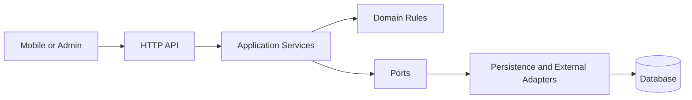

# Backend Architecture

## Runtime Map



## Boundaries

- API: HTTP request parsing, authentication context, response mapping.
- Application: use-case orchestration and transaction boundaries.
- Domain: GPA, graduation, scholarship, timetable, and recommendation rules.
- Ports: interfaces needed by application and domain services.
- Adapters: database repositories, OCR, source verification, maps, and push providers.

## Allowed Dependency Direction

```text
API → Application → Domain
Application → Ports ← Adapters
```

Domain code must not import Spring MVC, JPA, database clients, or external SDKs. Until modules exist, this rule is documented here and will be promoted to ArchUnit tests when the first domain boundary is implemented.

## Entry Point

`src/main/java/com/ahni/backend/AhniBackendApplication.java`
